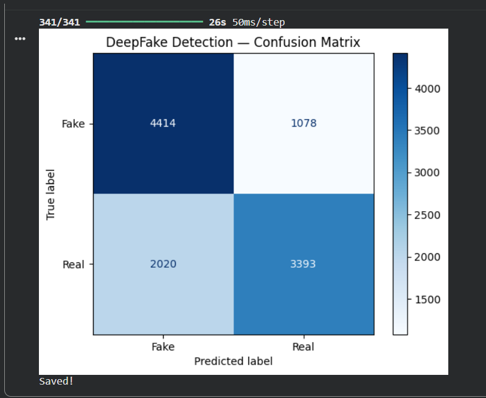
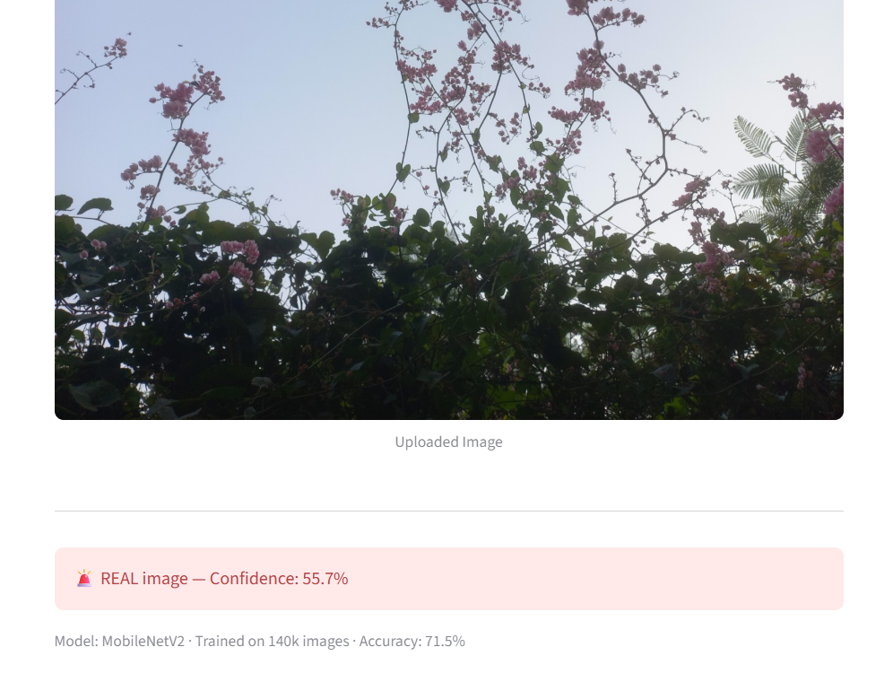
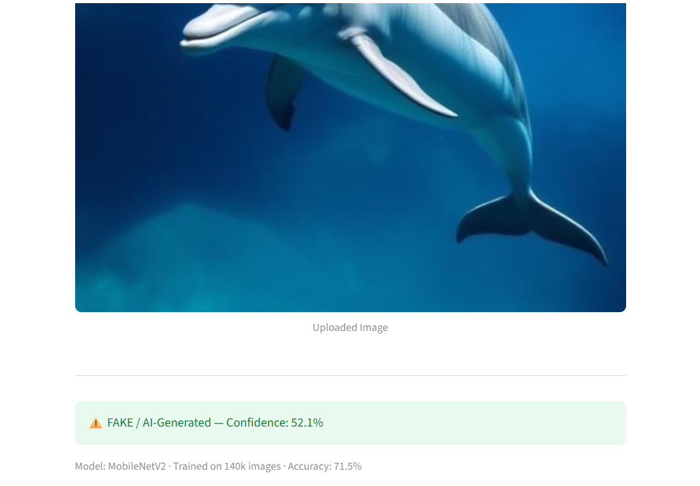
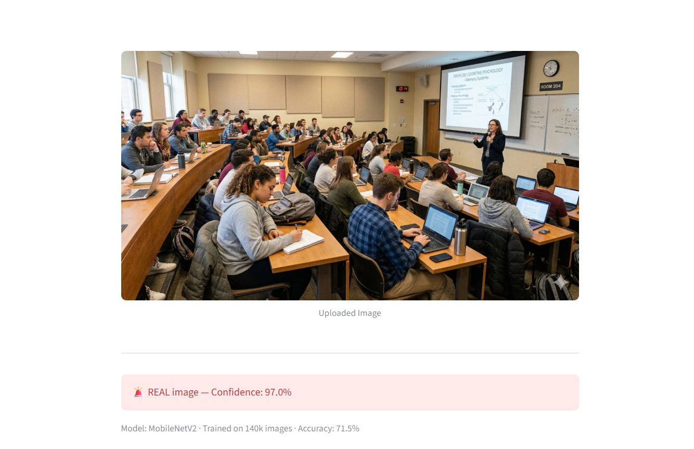

# 🔍 DeepFake Image Detector

A deep learning web app that classifies images as **Real** or **AI-Generated (Fake)**.

🚀 **Live Demo:** [deepfake-detector-kasviii.streamlit.app](https://deepfake-detector-kasviii.streamlit.app)

## Model
- Architecture: MobileNetV2 (Transfer Learning)
- Dataset: 140,000+ images (Real vs Fake)
- Test Accuracy: 71.5%
- Framework: TensorFlow / Keras

## Results
| Class | Precision | Recall | F1-Score |
|-------|-----------|--------|----------|
| Fake  | 0.69      | 0.80   | 0.74     |
| Real  | 0.76      | 0.63   | 0.69     |

## Limitations
Model was trained on GAN-based fakes. Performance on modern diffusion-based generators (Gemini, DALL-E, Midjourney) is lower as these post-date the training data.

## Example Predictions

Below are some example predictions from the deployed app.

### Real Image (Nature)
Prediction: **REAL**  
Confidence: **55.7%**

The model correctly classifies this natural scene, although the confidence is moderate.

---

### AI Generated Image (Dolphin)
Prediction: **FAKE / AI-Generated**  
Confidence: **52.1%**

The model correctly detects this AI-generated dolphin image, but with relatively low confidence.

---

### AI Generated Image (Classroom Scene)
Prediction: **REAL** ❌  
Confidence: **97.0%**

This image was generated using a modern diffusion-based model (Gemini).  
The detector incorrectly classified it as real with high confidence.

This highlights a key limitation of the model: it was trained primarily on **GAN-based fake images**, while newer generators (Gemini, DALL·E, Midjourney, Stable Diffusion) use **diffusion models**, which produce more realistic outputs.

## Stack
- Python, TensorFlow, Streamlit
- Deployed on Streamlit Community Cloud